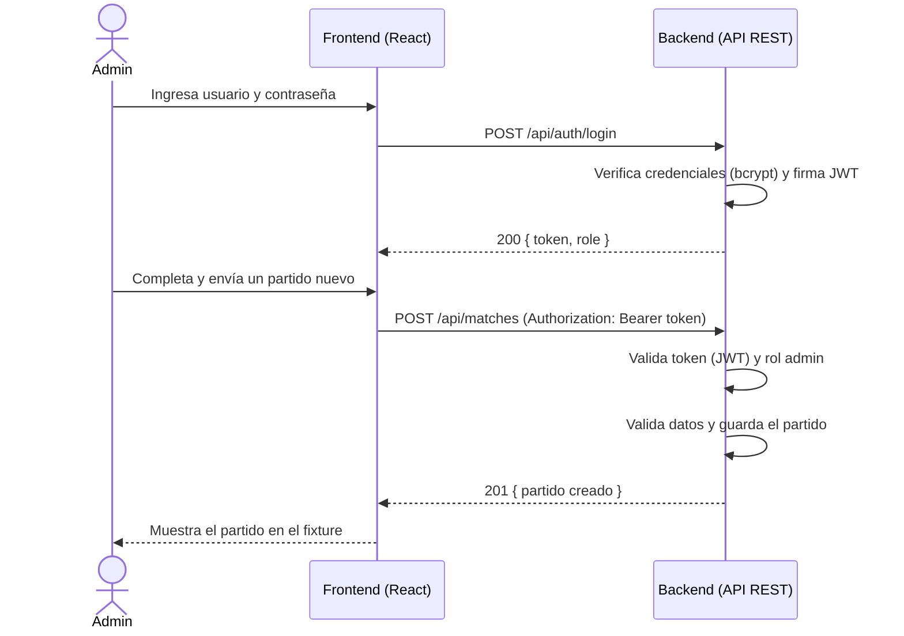

#  Fixture Mundial 2026 — API REST + Frontend

Trabajo Práctico N° 1 — **Git y Docker** · Ingeniería de Software
Autor: **Valentín Sánchez**

API REST para gestionar el fixture (partidos) del Mundial 2026, con autenticación
por JWT y un frontend en React para visualizar y administrar los partidos. Todo el
proyecto está dockerizado y orquestado con Docker Compose.

---

## Descripción

La aplicación permite **consultar el fixture** del Mundial de forma pública y
**administrarlo** (crear partidos, cargar resultados y eliminarlos) solo para
usuarios autenticados con rol de administrador.

Se compone de dos servicios:

- **Backend** — API REST en Node.js + TypeScript (Express), con arquitectura en
  capas, seguridad mediante JWT y contraseñas hasheadas con bcrypt.
- **Frontend** — Aplicación SPA en React + TypeScript (Vite), servida con Nginx.

---

## Tecnologías utilizadas

| Capa        | Tecnologías                                              |
| ----------- | -------------------------------------------------------- |
| Backend     | Node.js 20, TypeScript, Express, JWT, bcrypt             |
| Frontend    | React 18, TypeScript, Vite, Nginx                        |
| Contenedores| Docker, Docker Compose (builds multi-stage)              |
| CI/CD       | GitHub Actions (build + push a Docker Hub)               |

---

## Arquitectura del backend

El backend separa responsabilidades en capas, de modo que cada una tiene un único
motivo para cambiar. Esto facilita el mantenimiento, las pruebas y la evolución
(por ejemplo, reemplazar el almacenamiento en memoria por una base de datos real
solo afecta a la capa de repositorios).

```
Cliente HTTP
    │
    ▼
[ Routes ]        Definen los endpoints y la política de seguridad (quién puede qué).
    │
    ▼
[ Middlewares ]   Autenticación (JWT), autorización (roles) y manejo central de errores.
    │
    ▼
[ Controllers ]   Adaptan HTTP (req/res) a llamadas de servicio. Son finos.
    │
    ▼
[ Services ]      Lógica de negocio y validaciones. El corazón de la app.
    │
    ▼
[ Repositories ]  Acceso a datos (hoy, almacén en memoria).
    │
    ▼
[ Domain ]        Modelos y tipos del negocio. No dependen de ninguna tecnología.
```

---

## 📡 Endpoints de la API

Base URL: `http://localhost:3000/api`

### Autenticación

| Método | Endpoint         | Descripción                          | Auth |
| ------ | ---------------- | ------------------------------------ | ---- |
| POST   | `/auth/register` | Registra un usuario (rol `user`)     | No   |
| POST   | `/auth/login`    | Devuelve un token JWT                 | No   |
| GET    | `/auth/me`       | Datos del usuario autenticado         | Sí   |

### Partidos (fixture)

| Método | Endpoint               | Descripción                       | Auth         |
| ------ | ---------------------- | --------------------------------- | ------------ |
| GET    | `/matches`             | Lista todos los partidos          | No (público) |
| GET    | `/matches?group=A`     | Filtra por grupo                  | No (público) |
| GET    | `/matches/:id`         | Un partido por id                 | No (público) |
| POST   | `/matches`             | Crea un partido                   | admin        |
| PATCH  | `/matches/:id/result`  | Carga el resultado de un partido  | admin        |
| DELETE | `/matches/:id`         | Elimina un partido                | admin        |
| GET    | `/health`              | Healthcheck                       | No           |

### Ejemplo de uso (cURL)

```bash
# 1) Login como admin (devuelve un token)
curl -X POST http://localhost:3000/api/auth/login \
  -H "Content-Type: application/json" \
  -d '{"username":"admin","password":"admin1234"}'

# 2) Crear un partido usando el token
curl -X POST http://localhost:3000/api/matches \
  -H "Authorization: Bearer <TU_TOKEN>" \
  -H "Content-Type: application/json" \
  -d '{"group":"E","homeTeam":"Brasil","awayTeam":"Croacia","stadium":"AT&T Stadium","city":"Dallas","date":"2026-06-14T18:00:00Z"}'
```

---

## Seguridad

- **Login con JWT**: el cliente obtiene un token al autenticarse y lo envía en el
  header `Authorization: Bearer <token>` en cada petición protegida.
- **Contraseñas hasheadas**: nunca se guardan en texto plano (bcrypt).
- **Roles**: `user` (solo lectura) y `admin` (lectura y escritura).
- **Mensajes de error genéricos** en el login para no revelar si un usuario existe.
- El backend corre en el contenedor como **usuario sin privilegios** (no root).

> ⚠️ El usuario admin por defecto es `admin` / `admin1234` (definido por variables
> de entorno). **Cambialo en producción.**

---

## Diagrama de Secuencia del Sistema (SSD)

Flujo de un administrador que inicia sesión y crea un partido:



---

## Requisitos previos

- [Docker](https://www.docker.com/) y Docker Compose
- (Opcional, para correr sin Docker) [Node.js](https://nodejs.org/) 20+

---

## Instalación y ejecución

### Opción A — Con Docker Compose (recomendada)

```bash
# 1) Clonar el repositorio
git clone <URL_DEL_REPOSITORIO>
cd tp1-git-docker

# 2) (Opcional) Configurar variables de entorno
cp .env.example .env   # y editá los valores

# 3) Construir y levantar todo el stack
docker compose up --build
```

Luego abrí en el navegador:

- **Frontend**: http://localhost:8080
- **API**: http://localhost:3000/api/matches

Para detener todo: `docker compose down`

### Opción B — Construir y correr cada imagen por separado

```bash
# Backend
cd backend
docker build -t mundial-backend .
docker run -p 3000:3000 mundial-backend

# Frontend (en otra terminal)
cd frontend
docker build -t mundial-frontend --build-arg VITE_API_URL=http://localhost:3000/api .
docker run -p 8080:80 mundial-frontend
```

### Opción C — Sin Docker (desarrollo)

```bash
# Backend
cd backend && npm install && npm run dev      # http://localhost:3000

# Frontend (en otra terminal)
cd frontend && npm install && npm run dev      # http://localhost:5173
```

---

## Variables de entorno

Definidas en `.env.example`. Las principales:

| Variable         | Servicio | Descripción                                   | Default                  |
| ---------------- | -------- | --------------------------------------------- | ------------------------ |
| `PORT`           | backend  | Puerto de la API                              | `3000`                   |
| `CORS_ORIGIN`    | backend  | Origen permitido para CORS                    | `*`                      |
| `JWT_SECRET`     | backend  | Secreto para firmar los tokens JWT            | (cambiar en producción)  |
| `JWT_EXPIRES_IN` | backend  | Expiración del token                          | `2h`                     |
| `ADMIN_USER`     | backend  | Usuario admin inicial                         | `admin`                  |
| `ADMIN_PASSWORD` | backend  | Contraseña del admin inicial                  | `admin1234`              |
| `VITE_API_URL`   | frontend | URL de la API que consume el frontend         | `http://localhost:3000/api` |

---

## Publicación en Docker Hub

Las imágenes se publican automáticamente vía GitHub Actions al hacer push a `main`
(ver `.github/workflows/ci.yml`). Para hacerlo manualmente:

```bash
# Backend
docker build -t <usuario>/mundial-backend:latest ./backend
docker push <usuario>/mundial-backend:latest

# Frontend
docker build -t <usuario>/mundial-frontend:latest ./frontend
docker push <usuario>/mundial-frontend:latest
```

---

## CI/CD con GitHub Actions

El workflow `.github/workflows/ci.yml`:

1. **build**: compila backend y frontend en cada push y pull request a `main`.
2. **docker**: si el build pasa y es un push a `main`, construye las imágenes y las
   sube a Docker Hub.

Secrets necesarios en el repositorio (Settings → Secrets and variables → Actions):

- `DOCKERHUB_USERNAME`
- `DOCKERHUB_TOKEN`

---

## Estructura del proyecto

```
tp1-git-docker/
├── backend/                # API REST (Node + TS + Express)
│   ├── src/
│   │   ├── config/         # Lectura de variables de entorno
│   │   ├── domain/         # Modelos, tipos y errores del negocio
│   │   ├── repositories/   # Acceso a datos (en memoria)
│   │   ├── services/       # Lógica de negocio y seguridad
│   │   ├── controllers/    # Adaptadores HTTP
│   │   ├── middlewares/    # Auth, roles y manejo de errores
│   │   ├── routes/         # Definición de endpoints
│   │   ├── app.ts          # Ensamblado de Express
│   │   └── index.ts        # Arranque del servidor
│   ├── Dockerfile          # Build multi-stage
│   └── .env.example
├── frontend/               # SPA (React + TS + Vite)
│   ├── src/
│   │   ├── components/      # Login, MatchForm, MatchList
│   │   ├── api.ts          # Cliente HTTP de la API
│   │   ├── App.tsx         # Componente raíz
│   │   └── main.tsx        # Punto de entrada
│   ├── Dockerfile          # Build multi-stage + Nginx
│   └── nginx.conf
├── docker-compose.yml      # Orquesta backend + frontend
├── .github/workflows/ci.yml
├── .gitignore
└── .env.example
```

---

## Reflexión

Combinar **Git** (control de versiones y colaboración) con **Docker** (entornos
reproducibles) permite trabajar de forma más profesional: cualquier persona puede
clonar el repositorio y levantar exactamente el mismo entorno con un solo comando,
sin importar su sistema operativo. La arquitectura en capas, la seguridad con JWT y
la integración continua con GitHub Actions completan un flujo de trabajo cercano al
de un entorno productivo.
