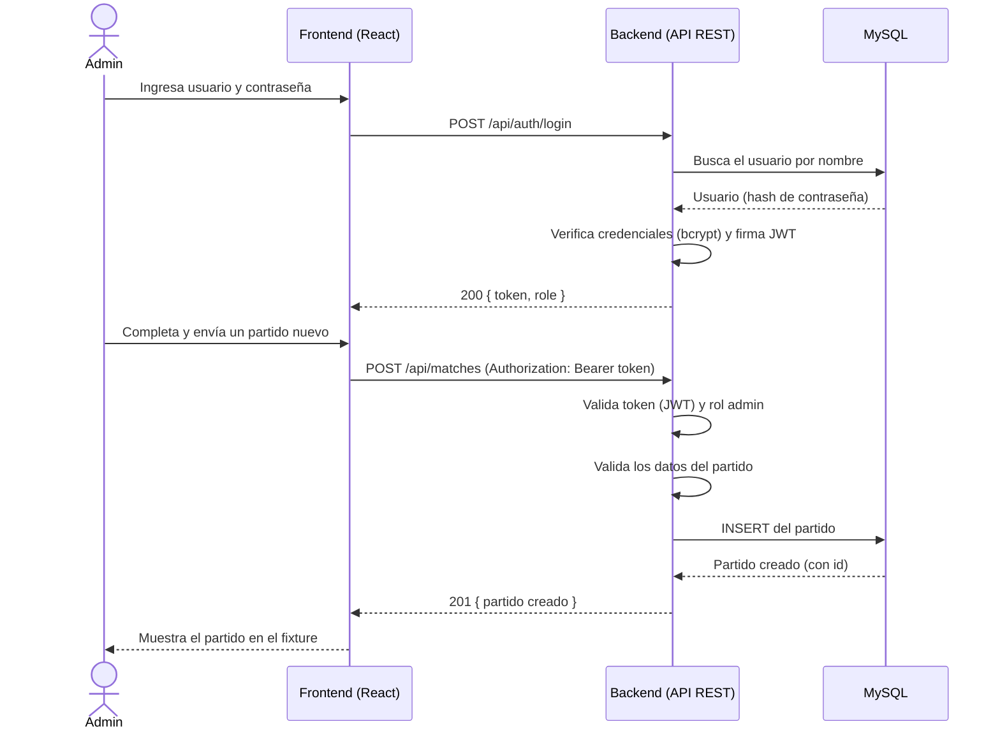

# Diagrama de secuencia del sistema (SSD)

Flujo de un administrador que inicia sesión y crea un partido:

```mermaid
sequenceDiagram
    actor Admin
    participant FE as Frontend (React)
    participant API as Backend (API REST)
    participant DB as MySQL

    Admin->>FE: Ingresa usuario y contraseña
    FE->>API: POST /api/auth/login
    API->>DB: Busca el usuario por nombre
    DB-->>API: Usuario (hash de contraseña)
    API->>API: Verifica credenciales (bcrypt) y firma JWT
    API-->>FE: 200 { token, role }

    Admin->>FE: Completa y envía un partido nuevo
    FE->>API: POST /api/matches (Authorization: Bearer token)
    API->>API: Valida token (JWT) y rol admin
    API->>API: Valida los datos del partido
    API->>DB: INSERT del partido
    DB-->>API: Partido creado (con id)
    API-->>FE: 201 { partido creado }
    FE-->>Admin: Muestra el partido en el fixture
```
